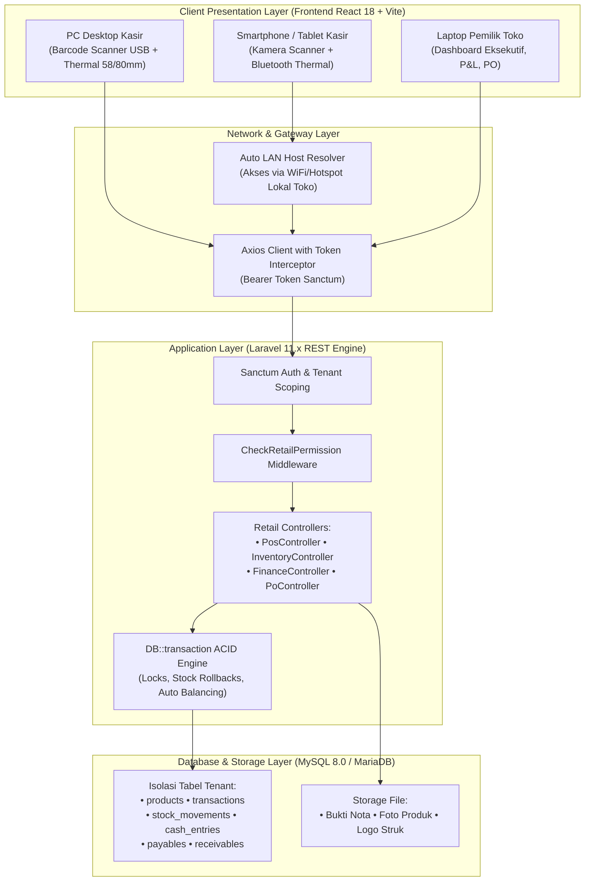
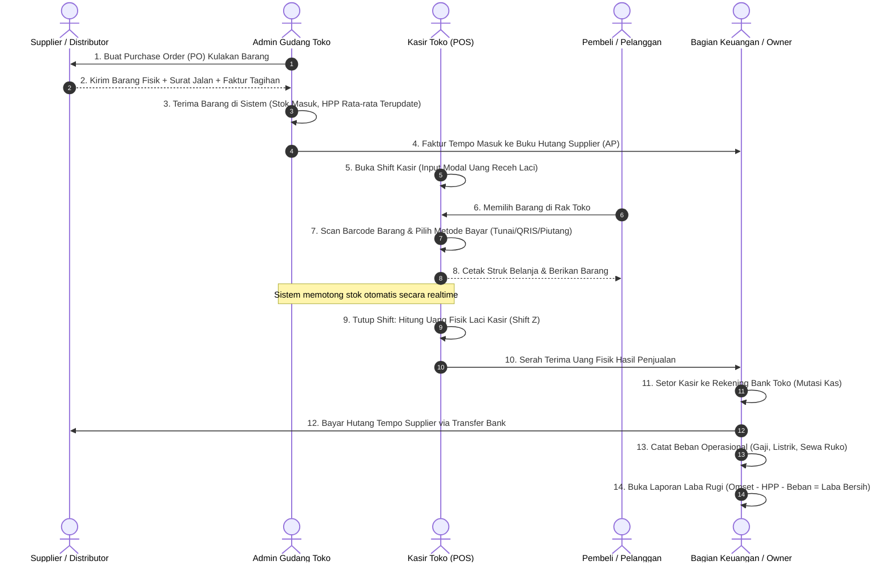
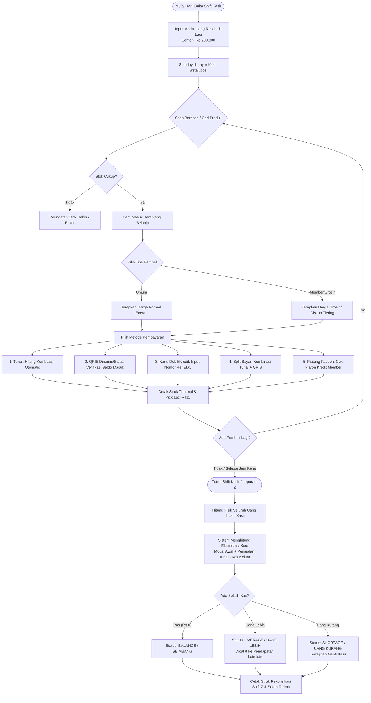
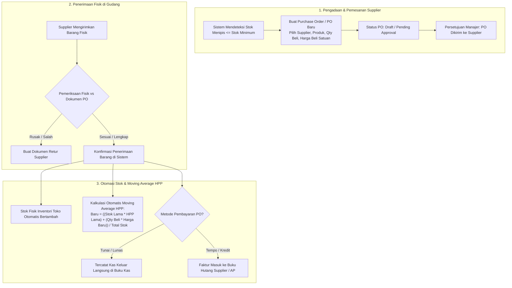
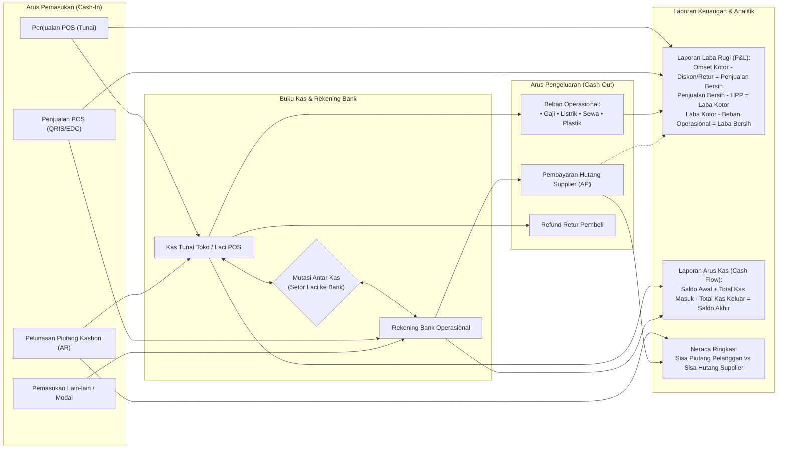
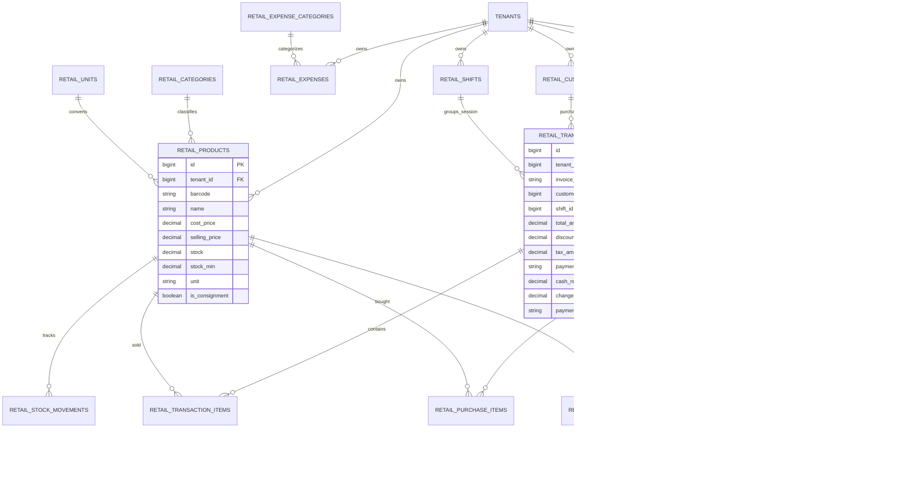

# 📖 BUKU PANDUAN LENGKAP & DOKUMENTASI SISTEM: MODUL RETAIL & POS BIZORA SAAS
### Panduan Operasional End-to-End, Skema Diagram, Kamus Rumus Finansial, dan Referensi 37 Menu

---

## 📑 DAFTAR ISI BESAR

1. [BAB I: PENDAHULUAN & ARSITEKTUR MULTI-TENANT](#bab-i-pendahuluan--arsitektur-multi-tenant)
   - 1.1 Profil Modul Retail Bizora
   - 1.2 Prinsip Isolasi Data Multi-Tenant
   - 1.3 Struktur Peran Pengguna (Role-Based Access Control / RBAC)
2. [BAB II: SKEMA & DIAGRAM SISTEM (END-TO-END SCHEMAS)](#bab-ii-skema--diagram-sistem-end-to-end-schemas)
   - 2.1 Skema Arsitektur Aplikasi (High-Level Architecture)
   - 2.2 Diagram Alur Siklus Bisnis Retail (End-to-End Workflow)
   - 2.3 Skema Alur Transaksi Kasir & Rekonsiliasi Kas (POS & Shift Z)
   - 2.4 Skema Alur Logistik, Pembelian (PO), & Moving Average HPP
   - 2.5 Skema Alur Integrasi Keuangan (Cashflow, AP, AR, P&L)
   - 2.6 Entity Relationship Diagram (ERD) Modul Retail
3. [BAB III: PANDUAN MEMULAI (GETTING STARTED & ONBOARDING)](#bab-iii-panduan-memulai-getting-started--onboarding)
   - 3.1 Langkah 1: Pengaturan Identitas Toko & Struk Kasir
   - 3.2 Langkah 2: Setup Multi-Outlet & Gudang
   - 3.3 Langkah 3: Konfigurasi Satuan (Multi-UOM) & Kategori
   - 3.4 Langkah 4: Setup Master Supplier & Pelanggan
4. [BAB IV: DOKUMENTASI DETAIL 37 MENU & TIAP FUNGSINYA](#bab-iv-dokumentasi-detail-37-menu--tiap-fungsinya)
   - 4.1 Kelompok Dashboard & Panduan (2 Menu)
   - 4.2 Kelompok Kasir (Point of Sale) & Sesi (3 Menu)
   - 4.3 Kelompok Data Master (8 Menu)
   - 4.4 Kelompok Logistik, Gudang & Inventori (7 Menu)
   - 4.5 Kelompok Promosi, Harga & Retur (4 Menu)
   - 4.6 Kelompok Keuangan & Akuntansi (8 Menu)
   - 4.7 Kelompok Laporan & Analitik Bisnis (7 Menu)
   - 4.8 Kelompok Pengaturan, Akses, API & Keamanan (6 Menu)
5. [BAB V: KAMUS RUMUS MATEMATIS & ALGORITMA FINANSIAL](#bab-v-kamus-rumus-matematis--algoritma-finansial)
   - 5.1 Rumus HPP Rata-Rata Tertimbang (Weighted Moving Average)
   - 5.2 Rumus Margin Keuntungan (%) vs Markup Harga (%)
   - 5.3 Rumus Pajak PPN (Eksklusif vs Inklusif / DPP)
   - 5.4 Rumus Rekonsiliasi Kas Laci (Expected Cash & Shift Z Variance)
   - 5.5 Rumus Nilai Selisih Stock Opname & Beban Kerugian
   - 5.6 Rumus Bagi Hasil Barang Konsinyasi (Titip Jual)
   - 5.7 Rumus Laba Rugi Komprehensif (P&L 4-Step)
6. [BAB VI: STANDAR OPERASIONAL PROSEDUR (SOP) HARIAN TOKO](#bab-vi-standar-operasional-prosedur-sop-harian-toko)
   - 6.1 SOP Buka Toko (Opening Shift Kasir)
   - 6.2 SOP Transaksi Kasir Kilat & Penanganan Antrean
   - 6.3 SOP Penanganan Retur Pembeli di Kasir
   - 6.4 SOP Penerimaan Barang PO dari Supplier
   - 6.5 SOP Tutup Shift Kasir (Closing Shift Z-Report)
   - 6.6 SOP Tutup Buku Keuangan Akhir Bulan
7. [BAB VII: PANDUAN PEMECAHAN MASALAH (TROUBLESHOOTING & FAQ)](#bab-vii-panduan-pemecahan-masalah-troubleshooting--faq)

---

## BAB I: PENDAHULUAN & ARSITEKTUR MULTI-TENANT

### 1.1 Profil Modul Retail Bizora
Modul **Retail & Point of Sale (POS)** Bizora dirancang untuk mengakomodasi seluruh spektrum usaha perdagangan eceran dan grosir modern di Indonesia, mulai dari:
- **Minimarket & Toko Kelontong Modern**
- **Toko Sembako & Agen Grosir Sembako**
- **Toko Pakaian, Fashion, & Sepatu**
- **Toko Kosmetik & Farmasi/Apotek**
- **Toko Komputer, Gadget, & Alat Listrik/Hardware**
- **Toko ATK & Toko Bahan Bangunan**

Sistem ini menggabungkan kecepatan transaksi di garis depan (*front-line POS register*), ketertiban gudang (*back-office inventory*), tata kelola hutang-piutang dagang, dan laporan keuangan komprehensif tanpa memerlukan keahlian akuntansi yang rumit.

### 1.2 Prinsip Isolasi Data Multi-Tenant
Setiap pelaku usaha yang terdaftar di Bizora memiliki ruang kerja (*workspace/tenant*) mandiri.
- **Tenant ID Scoping**: Seluruh query basis data (`retail_products`, `retail_transactions`, `retail_expenses`, dll) secara otomatis diinjeksi dengan klausul `tenant_id = auth()->user()->tenant_id`.
- **Kerahasiaan Mutlak**: Data produk, harga modal supplier, data pelanggan kasbon, serta catatan kas tidak dapat dilihat oleh toko lain yang sama-sama menggunakan platform Bizora.
- **Multi-Outlet Cabang**: Dalam 1 akun tenant, pemilik toko dapat membuka cabang outlet toko baru (Cabang 1, Cabang 2, Gudang Utama) dengan pencatatan inventori terpisah namun keuangan tetap terkonsolidasi ke pemilik (*owner*).

### 1.3 Struktur Peran Pengguna (Role-Based Access Control / RBAC)
Sistem menyediakan kontrol izin akses berbutir halus (*granular permissions*) untuk memastikan integritas data toko:

| Peran (Role) | Ruang Lingkup Akses | Menu yang Dapat Diakses | Batasan (Restrictions) |
|---|---|---|---|
| **Pemilik Toko (Owner)** | Akses Penuh (Full Super Admin) | Seluruh 37 menu tanpa batasan | Tidak ada batasan. Berwenang melihat Laba Bersih, HPP, Reset Database, dan API Key. |
| **Manajer / Supervisor Toko** | Operasional Toko & Gudang | POS, Produk, Pembelian PO, Stock Opname, Retur, Laporan Penjualan, Shift Report | Tidak dapat melihat Laba Bersih Utama, Pengaturan Langganan SaaS, atau API Key. |
| **Admin Gudang / Logistik** | Manajemen Barang Fisik | Produk, Satuan, PO, Penerimaan Stok, Mutasi Cabang, Stock Opname, Supplier | Tidak dapat mengakses Kasir POS, Buku Kas, Laba Rugi, dan Piutang. |
| **Kasir Toko (Cashier)** | Garis Depan Penjualan | Kasir POS, Buka/Tutup Shift Pribadi, Riwayat Transaksi Hari Ini, Cetak Struk | Dilarang mengubah HPP modal, dilarang void tanpa izin, dilarang melihat buku kas umum. |
| **Staf Akuntansi (Finance)** | Pembukuan & Keuangan | Buku Kas, Hutang Supplier, Piutang Pelanggan, Mutasi Kas, Laba Rugi, Pajak PPN | Akses baca pada transaksi kasir & pembelian PO untuk rekonsiliasi jurnal. |

---

## BAB II: SKEMA & DIAGRAM SISTEM (END-TO-END SCHEMAS)

### 2.1 Skema Arsitektur Aplikasi (High-Level Architecture)
Arsitektur Bizora Retail dibangun di atas tumpukan teknologi modern berkecepatan tinggi yang mendukung akses multi-device (PC Kasir, Laptop Manajer, Tablet, dan Smartphone Android/iOS).

---

### 2.2 Diagram Alur Siklus Bisnis Retail (End-to-End Workflow)
Diagram di bawah ini menggambarkan perjalanan siklus operasional bisnis toko retail dari kulakan barang ke pemasok hingga menghasilkan laba bersih kasir.

---

### 2.3 Skema Alur Transaksi Kasir & Rekonsiliasi Kas (POS & Shift Z)

---

### 2.4 Skema Alur Logistik, Pembelian (PO), & Moving Average HPP

---

### 2.5 Skema Alur Integrasi Keuangan (Cashflow, AP, AR, P&L)

---

### 2.6 Entity Relationship Diagram (ERD) Modul Retail

---

## BAB III: PANDUAN MEMULAI (GETTING STARTED & ONBOARDING)

Bagi pengguna baru (pemilik toko retail) yang baru pertama kali mendaftar akun Bizora, ikuti urutan langkah *onboarding* berikut agar sistem siap digunakan dalam waktu kurang dari 15 menit:

### 3.1 Langkah 1: Pengaturan Identitas Toko & Struk Kasir
1. Buka menu **Pengaturan Toko** (`/retail/settings`).
2. Masukkan **Nama Toko Resmi** (contoh: *Minimarket Berkah Jaya*).
3. Masukkan **Alamat Lengkap & Nomor Telepon / WhatsApp** toko yang akan dicetak pada kepala (*header*) struk kasir.
4. Unggah **Logo Toko** (format PNG/JPG transparan berukuran proporsional).
5. Atur **Catatan Kaki Struk (Footer)** (contoh: *"Barang yang sudah dibeli tidak dapat ditukar/dikembalikan kecuali ada perjanjian. Terima kasih atas kunjungan Anda!"*).
6. Tentukan pengaturan default PPN jika toko Anda menerapkan pajak pertambahan nilai (11% atau 0% jika non-PKP).

### 3.2 Langkah 2: Setup Multi-Outlet & Gudang
1. Buka menu **Outlet / Cabang** (`/retail/outlets`).
2. Secara default, sistem telah membuatkan 1 outlet utama (*Toko Utama / Pusat*).
3. Jika Anda memiliki cabang fisik kedua atau gudang terpisah, klik **+ Tambah Outlet Baru**.
4. Isi Nama Cabang, Alamat, dan Nomor Kontak. Seluruh mutasi stok antar cabang dapat dikontrol melalui menu *Transfer Stok*.

### 3.3 Langkah 3: Konfigurasi Satuan (Multi-UOM) & Kategori
1. Buka menu **Satuan Produk** (`/retail/units`). Masukkan satuan eceran dasar: `Pcs`, `Btl`, `Bks`, `Sachet`, `Kg`. Masukkan satuan kemasan besar: `Dus`, `Karton`, `Lusin` (rasio 12), `Renceng` (rasio 6/10).
2. Buka menu **Kategori Produk** (`/retail/categories`). Buat pengelompokan barang untuk memudahkan filter rak dan analitik:
   - Sembako & Kebutuhan Pokok
   - Makanan Ringan & Biskuit
   - Minuman Segar & Kopi
   - Perlengkapan Mandi & Cuci
   - Rokok & Korek Api
   - Obat-obatan & P3K

### 3.4 Langkah 4: Setup Master Supplier & Pelanggan
1. Buka menu **Pemasok / Supplier** (`/retail/suppliers`). Masukkan nama distributor tempat Anda biasa kulakan (misal: *PT Indomarco Adi Prima, CV Berkah Sembako*), lengkap dengan termin jatuh tempo default (contoh: Tempo 14 Hari).
2. Buka menu **Pelanggan / Member** (`/retail/customers`). Daftarkan pelanggan tetap, warung binaan, atau instansi yang sering berbelanja kasbon dengan menentukan **Plafon Kredit Maksimal** (misal: maks Rp 1.000.000).

---

## BAB IV: DOKUMENTASI DETAIL 37 MENU & TIAP FUNGSINYA

Berikut adalah dokumentasi operasional terperinci untuk seluruh 37 menu yang terdapat di dalam Modul Retail Bizora:

---

### 4.1 Kelompok Dashboard & Panduan (2 Menu)

#### 1. Dashboard Utama Retail (`/retail/dashboard`)
- **Tujuan Menu**: Pusat pemantauan real-time performa bisnis retail toko untuk pemilik dan manajer.
- **Komponen & Metrik Visual**:
  1. *Kartu KPI Omset Hari Ini*: Total nominal uang transaksi penjualan kotor hari ini dibanding hari kemarin (+/-% growth).
  2. *Kartu Transaksi Hari Ini*: Jumlah struk kasir yang dicetak hari ini.
  3. *Kartu Laba Kotor Hari Ini*: Estimasi laba kotor hari ini (Omset Hari Ini - Total HPP barang yang terjual).
  4. *Kartu Peringatan Stok Kritis*: Jumlah produk yang stoknya saat ini berada di bawah batas stok minimum (*reorder point*).
  5. *Grafik Penjualan Harian (Bar Chart)*: Visualisasi tren omset 7 hari atau 30 hari terakhir.
  6. *Daftar 5 Produk Terlaris (Top 5 Items)*: Daftar barang dengan frekuensi penjualan tertinggi hari ini.
  7. *Tabel Transaksi Terkini*: 10 struk kasir terakhir yang baru saja dicetak beserta status bayar.

#### 2. Buku Panduan & SOP Operasional (`/retail/guide`)
- **Tujuan Menu**: Modul literatur digital, SOP langkah demi langkah, dan kalkulator simulator bisnis yang disematkan langsung di dalam sistem.
- **Fungsi Utama**:
  1. *Navigasi Tab Topik*: Kasir POS, Shift Z, Multi-Satuan UOM, Purchasing PO, Keuangan & Hutang/Piutang, Rumus Laba Rugi, Developer API, dan Simulator.
  2. *Simulator Kalkulator Interaktif*: Input simulasi Harga Modal (HPP), Harga Jual, dan Diskon (%) untuk melihat kalkulasi Margin %, Markup %, dan Laba Rp secara instan.

---

### 4.2 Kelompok Kasir (Point of Sale) & Sesi (3 Menu)

#### 3. Kasir Kilat (Point of Sale) (`/retail/pos`)
- **Tujuan Menu**: Layar kasir berkecepatan tinggi (*fast checkout register*) yang dioptimalkan untuk input barcode fisik dan keyboard.
- **Fungsi & Tombol**:
  1. *Kolom Input Barcode / SKU (Autofocus)*: Otomatis membaca scanner barcode laser/USB. Tekan `Enter` untuk memasukkan produk ke keranjang.
  2. *Tombol Shortcut F2 (Cari Produk Manual)*: Membuka jendela pop-up pencarian barang berdasarkan nama jika barcode rusak.
  3. *Shortcut F4 (Bayar / Checkout)*: Langsung membuka modal dialog pilihan metode pembayaran.
  4. *Fitur Tahan Keranjang (Hold Cart)*: Menyimpan sementara keranjang belanja pelanggan yang tertahan tanpa membatalkannya, sehingga kasir dapat melayani pembeli antrean di belakangnya.
  5. *Fitur Panggil Keranjang (Recall Cart)*: Membuka kembali keranjang yang tadi ditahan untuk melanjutkan pembayaran.
  6. *Pemilihan Metode Pembayaran*:
     - **Tunai**: Terdapat tombol pecahan cepat (Uang Pas, Rp 20rb, Rp 50rb, Rp 100rb). Sistem otomatis menghitung nominal kembalian.
     - **QRIS Dinamis/Statis**: Menampilkan kode QRIS untuk discan pembeli.
     - **Debit / Kartu Kredit EDC**: Input nomor referensi struk mesin EDC bank.
     - **Split Payment**: Memungkinkan pembeli membayar sebagian tunai dan sisanya via transfer/QRIS.
     - **Piutang / Kasbon Member**: Khusus pembeli yang terdaftar di database pelanggan dengan limit kredit mencukupi.
  7. *Cetak Struk & Auto Kick Drawer*: Mengirim perintah cetak ke printer thermal (58mm/80mm) dan mengirim pulsa sinyal RJ11 untuk membuka laci kasir otomatis.

#### 4. Buka & Tutup Shift Kasir (`/retail/shifts`)
- **Tujuan Menu**: Prosedur pertanggungjawaban fisik uang tunai laci kasir per pergantian kasir atau penutupan toko harian.
- **Fungsi Utama**:
  1. *Buka Shift Baru*: Memasukkan modal awal uang receh kembalian yang diterima kasir saat memulai tugas.
  2. *Tutup Shift (Laporan Z)*: Mengunci sesi kasir saat selesai bertugas. Kasir menghitung dan memasukkan total fisik uang kertas dan koin di laci.
  3. *Audit Selisih Kasir*: Sistem membandingkan uang fisik vs ekspektasi sistem (Modal Awal + Penjualan Tunai - Kas Keluar). Menampilkan indikator apakah uang kasir Pas (*Balance*), Lebih (*Overage*), atau Kurang (*Shortage*).
  4. *Cetak Struk Shift Z*: Mencetak rekapitulasi shift kasir untuk ditandatangani kasir dan diserahkan ke pemilik toko.

#### 5. Riwayat Transaksi Kasir (`/retail/transactions`)
- **Tujuan Menu**: Arsip pencarian seluruh struk transaksi kasir yang pernah diterbitkan.
- **Fungsi Utama**:
  1. *Pencarian Struk*: Filter berdasarkan Nomor Faktur/Invoice, Rentang Tanggal, Nama Kasir, dan Metode Pembayaran.
  2. *Detail Invoice*: Melihat rincian barang apa saja yang dibeli pada nomor transaksi terkait.
  3. *Cetak Ulang Struk (Reprint)*: Mencetak ulang struk jika kertas printer kasir habis atau pelanggan meminta salinan nota.
  4. *Void Transaksi (Pembatalan)*: Membatalkan transaksi salah input (hanya dapat dilakukan oleh pengguna dengan hak akses Supervisor/Owner). Stok barang otomatis dikembalikan ke rak.

---

### 4.3 Kelompok Data Master (8 Menu)

#### 6. Manajemen Produk & Barang (`/retail/products`)
- **Tujuan Menu**: Pusat data seluruh barang dagangan yang dijual di toko.
- **Fungsi & Kolom Input**:
  1. *Barcode / SKU*: Nomor barcode resmi pabrik (EAN-13) atau kode unik buatan toko.
  2. *Nama Produk*: Nama lengkap barang dagangan (contoh: *Minyak Goreng SunCo Pouch 2L*).
  3. *Kategori & Satuan Dasar*: Menghubungkan produk ke master kategori dan satuan eceran terkecil.
  4. *Harga Beli Modal (HPP)*: Harga beli saat kulakan ke supplier.
  5. *Harga Jual Eceran*: Harga tag yang ditagihkan ke pembeli umum di kasir.
  6. *Stok Saat Ini & Stok Minimum*: Batas ambang peringatan agar sistem memberi sinyal kuning saat stok menipis.
  7. *Toggle Konsinyasi (Titip Jual)*: Menandai apakah barang merupakan milik toko sendiri atau titipan UMKM pihak ketiga.
  8. *Upload Gambar Produk*: Foto produk untuk tampilan kasir berbasis sentuh (tablet/HP).
  9. *Impor & Ekspor Excel*: Mengunggah ribuan produk sekaligus via template Excel (.xlsx).

#### 7. Kategori Produk (`/retail/categories`)
- **Tujuan Menu**: Mengelompokkan barang berdasarkan divisi/lorong toko.
- **Fungsi Utama**: Tambah, ubah, dan hapus kategori produk. Memantau total jumlah item barang di bawah tiap kategori.

#### 8. Satuan Multi-UOM (`/retail/units`)
- **Tujuan Menu**: Mengatur fleksibilitas satuan jual dan rasio konversi grosir.
- **Fungsi Utama**: Mendefinisikan satuan turunan (contoh: 1 Dus = 24 Pcs, 1 Renceng = 10 Sachet). Memungkinkan kasir menjual 1 Dus di POS dan sistem otomatis memotong 24 Pcs dari stok inventori.

#### 9. Data Pelanggan & Member (`/retail/customers`)
- **Tujuan Menu**: Mengelola basis data pembeli setia toko (CRM).
- **Fungsi Utama**:
  1. *Data Identitas*: Nama, Nomor WhatsApp, Alamat rumah/toko pelanggan.
  2. *Plafon Limit Piutang*: Mengatur batas nominal maksimal kasbon yang diizinkan untuk pelanggan tersebut.
  3. *Poin Loyalitas*: Mengakumulasikan poin belanja yang dapat ditukarkan voucher diskon di kasir.

#### 10. Data Pemasok / Supplier (`/retail/suppliers`)
- **Tujuan Menu**: Direktori kontak distributor, sales pabrik, dan agen kulakan.
- **Fungsi Utama**: Mencatat Nama PT/CV Supplier, Nama Sales, No. HP, Alamat Gudang Supplier, dan Termin Pembayaran Default (Cash on Delivery vs Tempo 14/30 Hari).

#### 11. Manajemen Cabang / Outlet (`/retail/outlets`)
- **Tujuan Menu**: Menambah dan mengelola titik toko fisik atau gudang satelit.
- **Fungsi Utama**: Menentukan nama cabang, alamat, penanggung jawab cabang, dan melihat saldo stok spesifik per outlet.

#### 12. Manajemen Batch & Kadaluarsa (`/retail/batches`)
- **Tujuan Menu**: Pengawasan barang yang memiliki masa kedaluwarsa (makanan, minuman, susu, kosmetik, obat).
- **Fungsi Utama**: Mencatat Nomor Batch produksi dan Tanggal Expired. Sistem mengimplementasikan algoritma **FEFO (First Expired, First Out)** agar kasir memprioritaskan stok yang paling mendekati tanggal basi dan menampilkan peringatan saat H-30 kadaluarsa.

#### 13. Pelacakan Serial Number / IMEI (`/retail/serials`)
- **Tujuan Menu**: Khusus toko gadget, handphone, laptop, dan elektronik yang memerlukan pelacakan nomor seri unik per unit barang.
- **Fungsi Utama**: Mendaftarkan nomor SN/IMEI saat barang masuk dan memvalidasi SN saat transaksi kasir untuk klaim garansi toko.

---

### 4.4 Kelompok Logistik, Gudang & Inventori (7 Menu)

#### 14. Pesanan Pembelian / Kulakan (PO) (`/retail/purchase-orders`)
- **Tujuan Menu**: Pengadaan barang terencana ke supplier untuk mencegah kekosongan stok toko.
- **Fungsi & Alur Kerja**:
  1. *Buat PO Baru*: Pilih supplier tujuan, pilih daftar barang yang ingin dibeli beserta kuantiti dan harga beli yang disepakati.
  2. *Approval & Kirim*: Mengubah status PO menjadi *Dipesan* dan mencetak surat PO resmi atau mengirim PDF ke WhatsApp supplier.
  3. *Penerimaan Barang (Receiving)*: Saat armada supplier tiba, gudang melakukan checklist barang fisik. Klik **Terima Barang** $\rightarrow$ stok inventori toko otomatis bertambah, HPP Moving Average dihitung ulang, dan tagihan faktur masuk ke modul Hutang Supplier (AP).

#### 15. Penerimaan Stok Cepat (`/retail/stock`)
- **Tujuan Menu**: Penyesuaian stok masuk cepat untuk barang kulakan pasar curah tanpa melalui proses Purchase Order formal.
- **Fungsi Utama**: Memilih produk, memasukkan jumlah barang masuk, harga beli modal, dan sumber dana kas.

#### 16. Nilai Aset Inventori Realtime (`/retail/inventory`)
- **Tujuan Menu**: Dasbor pemantauan total saldo fisik barang dan valuasi nilai aset toko.
- **Fungsi Utama**:
  1. *Valuasi Aset Stok*: Menampilkan total nilai uang modal yang tertahan di rak toko (`Total Stok * HPP Satuan`).
  2. *Filter Kritis*: Menampilkan daftar barang habis (*Out of Stock*) dan barang menipis (*Low Stock*).

#### 17. Kartu Stok Elektronik (`/retail/stock-movements`)
- **Tujuan Menu**: Jejak audit pergerakan keluar-masuk setiap produk (*audit trail*).
- **Fungsi Utama**: Menampilkan kronologi mutasi per produk: Tanggal, Jenis Pergerakan (Penjualan POS, Pembelian PO, Retur, Stock Opname), Jumlah Masuk/Keluar, dan Saldo Akhir Stok beserta nama user pelaku transaksi.

#### 18. Transfer Stok Antar Cabang (`/retail/stock-transfers`)
- **Tujuan Menu**: Mengirimkan stok barang dari Gudang Pusat ke Cabang Toko atau antar cabang.
- **Fungsi Utama**: Membuat dokumen jalan transfer, memilih outlet asal dan outlet tujuan, mengurangi stok cabang pengirim, dan menambah stok cabang penerima setelah barang dikonfirmasi sampai.

#### 19. Audit Fisik Stok (Stock Opname) (`/retail/stock-opname`)
- **Tujuan Menu**: Pencocokan berkala antara stok fisik di rak toko vs data catatan komputer.
- **Fungsi Utama**:
  1. *Buka Sesi Opname*: Memilih sesi opname parsial (per kategori/rak) atau opname total seluruh toko.
  2. *Scan Hitung Fisik*: Staf toko memindai barcode barang di rak dan memasukkan jumlah fisik yang ada di tangan.
  3. *Kalkulasi Variance*: Sistem langsung menampilkan selisih kuantiti (*Fisik - Sistem*) dan mengalikan dengan HPP untuk mengetahui total nilai kerugian rupiah barang hilang/rusak.
  4. *Finalisasi & Adjusmen*: Menyetujui hasil opname $\rightarrow$ sistem otomatis mengoreksi angka stok komputer dan membukukan selisih minus ke Beban Kerugian Selisih Stok di laporan keuangan.

#### 20. Cetak Label Barcode & Price Tag (`/retail/print-labels`)
- **Tujuan Menu**: Mencetak stiker barcode untuk ditempel pada produk eceran atau label harga (*shelf talker*) rak toko.
- **Fungsi Utama**: Memilih daftar produk yang ingin dicetak labelnya, menentukan jumlah duplikat cetak, dan memilih layout kompatibel printer stiker label (format 3-kolom kertas stiker 33x15mm atau printer thermal label).

---

### 4.5 Kelompok Promosi, Harga & Retur (4 Menu)

#### 21. Promo & Aturan Diskon (`/retail/discounts`)
- **Tujuan Menu**: Mengatur strategi promosi toko untuk mendongkrak omset penjualan.
- **Fungsi Utama**: Membuat aturan diskon persentase (misal: *Diskon 20% Minyak Goreng*), diskon nominal (potongan Rp 5.000), promo beli 2 gratis 1, voucher kupon belanja, dan tanggal masa aktif promo.

#### 22. Daftar Harga Tiering (Pricelists) (`/retail/pricelists`)
- **Tujuan Menu**: Menentukan level harga jual yang berbeda untuk segmen pelanggan yang berbeda.
- **Fungsi Utama**:
  1. *Harga Eceran (Default)*: Ditagihkan kepada pembeli umum yang membeli satuan.
  2. *Harga Grosir Tier 1*: Berlaku otomatis jika pelanggan membeli minimal 12 pcs.
  3. *Harga Reseller / Member VIP*: Harga khusus pelanggan langganan yang terdaftar.

#### 23. Retur Barang ke Supplier (`/retail/supplier-returns`)
- **Tujuan Menu**: Mengembalikan barang rusak, cacat produksi, atau mendekati kedaluwarsa kepada distributor/supplier.
- **Fungsi Utama**: Memilih nomor PO asal, menentukan produk dan jumlah yang diretur, memasukkan alasan retur, dan memilih kompensasi (pemotongan tagihan hutang supplier atau pengembalian uang tunai).

#### 24. Retur Barang dari Pelanggan (`/retail/customer-returns`)
- **Tujuan Menu**: Melayani komplain pembeli yang mengembalikan barang cacat setelah transaksi kasir.
- **Fungsi Utama**: Memasukkan nomor struk asli penjualan, memilih item yang dikembalikan, mengembalikan stok barang ke gudang/karantina rusak, dan mengeluarkan dana refund kasir yang otomatis tercatat di rekonsiliasi kas.

---

### 4.6 Kelompok Keuangan & Akuntansi (8 Menu)

#### 25. Laporan Laba Rugi Komprehensif (P&L) (`/retail/finance/summary`)
- **Tujuan Menu**: Laporan kesehatan finansial utama yang menyajikan performa keuntungan bersih toko retail.
- **Struktur Laporan Finansial**:
  1. *Penjualan Kotor (Gross Sales)*: Total nilai seluruh transaksi kasir.
  2. *Potongan Penjualan*: Akumulasi diskon promosi dan retur pembeli.
  3. *Penjualan Bersih (Net Sales)*: Penjualan Kotor dikurangi Potongan.
  4. *Harga Pokok Penjualan (HPP / COGS)*: Akumulasi modal beli seluruh barang yang telah terjual.
  5. *Laba Kotor (Gross Profit)*: Penjualan Bersih dikurangi Total HPP.
  6. *Beban Operasional Toko*: Rincian biaya operasional (Gaji Karyawan, Listrik/Air, Sewa Tempat, Kantong Plastik & Lakban, Perbaikan Toko).
  7. *Laba Bersih Operasional*: Laba Kotor dikurangi Total Beban Operasional.
  8. *Laba Bersih Akhir (Net Profit)*: Laba Operasional disesuaikan pendapatan lain (pendapatan bunga/selisih kas lebih) dan pajak.
- **Fitur Ekspor**: Tombol *Cetak Laporan Format Akuntansi Formal* dan *Ekspor PDF / Excel*.

#### 26. Buku Kas & Catatan Kas Operasional (`/retail/finance/cash`)
- **Tujuan Menu**: Pencatatan seluruh mutasi uang tunai masuk dan keluar di luar transaksi kasir POS.
- **Fungsi Utama**:
  1. *Tambah Transaksi Kas Keluar*: Mencatat pengeluaran operasional toko (misal: bayar iuran keamanan lingkungan, beli token listrik toko, beli konsumsi lembur kasir).
  2. *Tambah Transaksi Kas Masuk*: Mencatat penerimaan uang non-penjualan (misal: setoran modal tambahan pemilik, pendapatan sewa teras depan toko untuk pedagang kaki lima).
  3. *Filter Kategori Akun*: Menyortir pengeluaran per pos akun anggaran.

#### 27. Buku Hutang Dagang Supplier (AP) (`/retail/finance/payables`)
- **Tujuan Menu**: Pengelolaan kewajiban pembayaran tempo kepada para distributor kulakan.
- **Fungsi Utama**:
  1. *Daftar Faktur Hutang*: Menampilkan seluruh nomor faktur PO pembelian yang belum lunas beserta nama supplier dan tanggal jatuh tempo (*due date*).
  2. *Indikator Status Jatuh Tempo*: Badge kuning untuk tagihan mendekati H-3 jatuh tempo, dan badge merah menyala untuk tagihan yang telah lewat jatuh tempo (*Overdue*).
  3. *Bayar Hutang / Cicilan*: Klik tombol bayar untuk mencatat transfer pelunasan (penuh atau sebagian/cicilan). Saldo hutang supplier berkurang dan kas bank otomatis tercatat keluar.

#### 28. Buku Piutang Pelanggan / Kasbon (AR) (`/retail/finance/receivables`)
- **Tujuan Menu**: Buku pengawasan tagihan kasbon pembeli langganan atau instansi.
- **Fungsi Utama**:
  1. *Daftar Piutang Berjalan*: Memantau nama pelanggan, nomor struk kasbon, tanggal belanja, total kasbon, dan sisa piutang.
  2. *Terima Pembayaran Piutang*: Mencatat uang setoran kasbon dari pembeli (tunai atau transfer bank). Saldo piutang pembeli berkurang seketika dan uang masuk ke buku kas toko.
  3. *Riwayat Pembayaran*: Catatan jejak riwayat cicilan pelunasan kasbon per pelanggan.

#### 29. Mutasi Antar Kas & Setor Bank (`/retail/finance/transfers`)
- **Tujuan Menu**: Pemindahan saldo dana internal toko tanpa mempengaruhi laporan laba rugi.
- **Fungsi Utama**: Digunakan saat pemilik toko menyetorkan akumulasi uang tunai dari laci kasir ke rekening Bank BCA/Mandiri toko, atau menarik uang dari bank untuk dijadikan modal kasir kas kecil. Saldo akun asal berkurang dan saldo akun tujuan bertambah secara berimbang (*double-entry balancing*).

#### 30. Laporan Arus Kas (Cash Flow) (`/retail/finance/cash-flow`)
- **Tujuan Menu**: Laporan likuiditas uang tunai yang mengelompokkan mutasi kas ke dalam 3 aktivitas standar:
  1. *Aktivitas Operasional*: Penerimaan kasir POS, pelunasan piutang, pembayaran supplier, dan beban operasional toko.
  2. *Aktivitas Investasi*: Pembelian aset fisik toko (misal: beli AC baru, beli rak gondola minimarket, beli genset).
  3. *Aktivitas Pendanaan*: Penambahan modal setor pemilik atau penarikan prive pribadi.

#### 31. Rekapitulasi Pajak PPN / PB1 (`/retail/finance/tax-report`)
- **Tujuan Menu**: Rekapitulasi perpajakan bagi toko yang telah berstatus Pengusaha Kena Pajak (PKP).
- **Fungsi Utama**:
  1. *Pajak Keluaran (Output Tax)*: Total PPN 11% yang dipungut dari pembeli di kasir POS.
  2. *Pajak Masukan (Input Tax)*: Total PPN 11% yang dibayarkan toko saat kulakan faktur resmi dari supplier.
  3. *Pajak Kurang/Lebih Bayar*: Pajak Keluaran dikurangi Pajak Masukan untuk menghitung nilai PPN yang wajib disetor ke kas negara.

#### 32. Bagan Akun / Kategori Keuangan (`/retail/finance-categories`)
- **Tujuan Menu**: Mengelola master pos kategori pengeluaran dan pemasukan kas.
- **Fungsi Utama**: Membuat kategori akun beban: *Beban Gaji & Upah, Beban Listrik, Air & Internet, Beban Sewa Bangunan, Beban Perlengkapan Toko, Beban Transport & Logistik, Pendapatan Lain-lain*.

---

### 4.7 Kelompok Laporan & Analitik Bisnis (7 Menu)

#### 33. Laporan Penjualan Lengkap (`/retail/reports/sales`)
- **Tujuan Menu**: Audit detail seluruh performa omset penjualan toko.
- **Fungsi Utama**: Filter laporan per rentang tanggal kustom, filter outlet cabang, filter kasir yang bertugas, perbandingan metode pembayaran (Tunai vs Digital), ekspor ke Excel dan cetak rekap penjualan harian.

#### 34. Laporan Performa Produk & Stok Laku (`/retail/reports/products`)
- **Tujuan Menu**: Menganalisa perputaran barang dagangan di toko.
- **Fungsi Utama**:
  1. *Fast-Moving Items*: Produk dengan kuantiti penjualan tertinggi (wajib dijaga stoknya agar tidak pernah kosong).
  2. *Slow-Moving / Dead Stock*: Produk yang jarang atau tidak pernah laku dalam 30-90 hari terakhir (membantu manajer membuat keputusan cuci gudang / diskon obral).

#### 35. Laporan Margin Keuntungan Produk (`/retail/reports/margins`)
- **Tujuan Menu**: Mengetahui produk mana yang paling banyak menyumbang profit bersih ke kantong pemilik toko.
- **Fungsi Utama**: Menampilkan tabel per produk: Harga Jual, HPP Modal, Nominal Margin Keuntungan (Rp), dan Persentase Margin Keuntungan (%). Mengidentifikasi produk "bintang" yang marginnya tebal vs produk komoditas yang marginnya tipis.

#### 36. Laporan Analitik Pelanggan (`/retail/reports/customers`)
- **Tujuan Menu**: Memetakan perilaku belanja pelanggan toko.
- **Fungsi Utama**: Menampilkan pelanggan *Top Spender* (pembelanja terbesar), frekuensi transaksi belanja pelanggan, dan total akumulasi poin reward member.

#### 37. Rekapitulasi Bagi Hasil Konsinyasi (`/retail/reports/consignment`)
- **Tujuan Menu**: Laporan perhitungan hak setor bagi hasil untuk produk titipan UMKM pihak ketiga.
- **Fungsi Utama**: Menampilkan per supplier titipan: Nama Barang, Jumlah Titip Masuk, Jumlah Terjual di Kasir, Sisa Stok Titipan, Hak Setor Uang ke Supplier Konsinyasi, dan Nilai Komisi/Keuntungan Bersih Toko.

#### 38. Laporan Rekap Shift Seluruh Kasir (`/retail/reports/shifts`)
- **Tujuan Menu**: Laporan historis penutupan kasir untuk audit manajemen.
- **Fungsi Utama**: Memantau daftar seluruh shift yang telah ditutup: jam buka/tutup, nama kasir, total modal receh, total penjualan tunai, dan riwayat selisih kas laci kasir dari waktu ke waktu.

#### 39. Laporan Saluran Pembayaran (`/retail/reports/payments`)
- **Tujuan Menu**: Rekapitulasi aliran uang berdasarkan instrumen bayar.
- **Fungsi Utama**: Memecah omset toko menjadi persentase: Tunai (Cash), QRIS BCA, QRIS Mandiri, Transfer Bank, Kartu Debit, Kartu Kredit, dan Piutang Kasbon. Berguna untuk rekonsiliasi mutasi rekening koran bank.

---

### 4.8 Kelompok Pengaturan, Akses, API & Keamanan (6 Menu)

#### 40. Manajemen Staf & Karyawan (`/retail/staff`)
- **Tujuan Menu**: Mendaftarkan akun login untuk seluruh karyawan toko (kasir, supervisor, admin gudang, akuntan).
- **Fungsi Utama**: Membuat username, email, password baru, memilih outlet penugasan, dan menetapkan Role Jabatan karyawan.

#### 41. Konfigurasi Hak Akses Role (RBAC) (`/retail/roles`)
- **Tujuan Menu**: Mengatur kewenangan apa saja yang boleh dan tidak boleh dilakukan oleh tiap jabatan karyawan.
- **Fungsi Utama**: Menyalakan atau mematikan checklist izin per modul (*Lihat, Tambah, Ubah, Hapus, Void Struk, Ekspor Excel*).

#### 42. Pengaturan Umum Toko (`/retail/settings`)
- **Tujuan Menu**: Pengaturan global aplikasi retail.
- **Fungsi Utama**: Mengubah nama toko, logo, alamat struk kasir, footer struk, batas toleransi selisih uang kasir, dan integrasi nomor printer thermal.

#### 43. Developer REST API & Webhook (`/retail/developer-api`)
- **Tujuan Menu**: Menghubungkan toko Bizora ke sistem luar (Website E-Commerce, Aplikasi Toko Online, ERP).
- **Fungsi Utama**:
  1. *Manajemen API Key*: Membuat dan meregenerasi Secret API Key (`X-API-Key: biz_live_xxxx`).
  2. *Webhook Event*: Mendaftarkan URL endpoint webhook untuk menerima notifikasi otomatis saat terjadi event `order.created` (struk baru terbit) atau `stock.low` (stok kritis).

#### 44. Cadangan Data Cloud & Pemulihan (`/retail/backup`)
- **Tujuan Menu**: Menjamin keamanan data toko terhadap risiko bencana (*disaster recovery*).
- **Fungsi Utama**:
  1. *Unduh Backup Excel (.xlsx)*: Mengunduh arsip seluruh data toko dalam format spreadsheet multi-sheet (Produk, Pelanggan, Supplier, Riwayat Transaksi, Mutasi Kas).
  2. *Unduh Database JSON (.json)*: Cadangan mentah relational dump untuk migrasi database.
  3. *Jadwal Backup Otomatis*: Menyalakan pengiriman arsip cadangan mingguan ke email pemilik toko.

#### 45. Status Langganan Bizora SaaS (`/retail/subscription`)
- **Tujuan Menu**: Memantau paket aktif software Bizora Anda.
- **Fungsi Utama**: Melihat masa aktif langganan, kuota transaksi bulanan, kuota outlet cabang yang tersisa, dan melakukan perpanjangan paket atau upgrade ke Paket Enterprise.

---

## BAB V: KAMUS RUMUS MATEMATIS & ALGORITMA FINANSIAL

Modul Retail Bizora menerapkan standar akuntansi dan matematika bisnis yang baku. Berikut adalah kamus rumus matematis yang berjalan di dalam kode sistem:

### 5.1 Rumus HPP Rata-Rata Tertimbang (Weighted Moving Average)
Harga beli dari supplier sering berubah naik/turun setiap minggu. Sistem Bizora secara otomatis menghitung ulang HPP rata-rata setiap kali gudang melakukan konfirmasi penerimaan barang baru dari Purchase Order (PO):

$$\text{HPP Baru} = \frac{(\text{Stok Lama} \times \text{HPP Lama}) + (\text{Qty Beli Baru} \times \text{Harga Beli Baru})}{\text{Stok Lama} + \text{Qty Beli Baru}}$$

> **Studi Kasus Nyata:**
> - Stok awal Minyak Goreng di toko: **10 Pcs** dengan HPP lama **Rp 14.000** (Nilai modal awal = Rp 140.000).
> - Toko membeli stok baru dari supplier: **20 Pcs** dengan harga beli baru naik menjadi **Rp 15.500** (Nilai belanja baru = Rp 310.000).
> - Total Nilai Modal = Rp 140.000 + Rp 310.000 = **Rp 450.000**.
> - Total Jumlah Barang = 10 + 20 = **30 Pcs**.
> - **HPP Baru yang Ditetapkan Sistem** = Rp 450.000 / 30 = **Rp 15.000 / Pcs**.

---

### 5.2 Rumus Margin Keuntungan (%) vs Markup Harga (%)
Perbedaan mendasar antara Margin dan Markup yang sering disalahpahami pemilik toko UMKM:

#### A. Rumus Margin Keuntungan (% Margin):
Mengukur berapa persen keuntungan bersih yang didapat dari setiap rupiah harga jual yang dibayar oleh pelanggan:

$$\text{Margin } (\%) = \left( \frac{\text{Harga Jual Akhir} - \text{HPP Modal}}{\text{Harga Jual Akhir}} \right) \times 100\%$$

#### B. Rumus Markup Harga (% Markup):
Mengukur berapa persen harga dinaikkan di atas harga modal beli dari supplier:

$$\text{Markup } (\%) = \left( \frac{\text{Harga Jual Akhir} - \text{HPP Modal}}{\text{HPP Modal}} \right) \times 100\%$$

> **Contoh Perbandingan:**
> - Toko kulakan kaos polos seharga modal **Rp 80.000 (HPP)**.
> - Toko menjual kaos tersebut dengan harga tag **Rp 100.000**.
> - Keuntungan Nominal = Rp 100.000 - Rp 80.000 = **Rp 20.000**.
> - **Markup Toko** = (Rp 20.000 / Rp 80.000) * 100% = **25.0%**.
> - **Margin Toko** = (Rp 20.000 / Rp 100.000) * 100% = **20.0%**.

---

### 5.3 Rumus Pajak PPN (Eksklusif vs Inklusif / DPP)

#### A. PPN Eksklusif (Pajak 11% Ditambahkan di Luar Harga Tag Rak):
$$\text{Nilai PPN} = \text{Subtotal Belanja} \times 11\%$$
$$\text{Total Tagihan Kasir} = \text{Subtotal Belanja} + \text{Nilai PPN}$$
*Contoh: Belanja Rp 100.000 + PPN Rp 11.000 = Total Bayar Rp 111.000.*

#### B. PPN Inklusif (Harga Tag Rak Sudah Termasuk PPN 11%):
Sistem memisahkan Dasar Pengenaan Pajak (DPP) dengan rumus:
$$\text{DPP (Dasar Pengenaan Pajak)} = \frac{\text{Total Harga Tag Rak}}{1.11}$$
$$\text{Nilai PPN} = \text{DPP} \times 11\%$$
*Contoh: Harga tag rak Rp 111.000. DPP Toko = Rp 100.000, dan Pajak PPN yang dipungut = Rp 11.000.*

---

### 5.4 Rumus Rekonsiliasi Kas Laci (Expected Cash & Shift Z Variance)
Saat kasir menutup shift, sistem menghitung ekspektasi kas fisik laci dengan rumus:

$$\text{Ekspektasi Kas Laci} = \text{Modal Awal Receh} + \text{Total Penjualan Tunai} + \text{Kas Masuk Non-POS} - \text{Kas Keluar Operasional} - \text{Refund Tunai}$$

*Catatan: Transaksi non-tunai (QRIS, Kartu Debit, Piutang) tidak dihitung ke uang fisik laci karena langsung masuk ke rekening bank / buku piutang.*

$$\text{Selisih Kas (Variance)} = \text{Total Uang Fisik Terhitung} - \text{Ekspektasi Kas Laci}$$

1. **Selisih = Rp 0**: *Kas Seimbang (Balance)*. Kasir bekerja 100% akurat.
2. **Selisih > 0 (Positif)**: *Kas Berlebih (Overage)*. Terjadi kelebihan uang di laci kasir (kemungkinan salah kembalian). Sistem membukukannya ke Pendapatan Selisih Kasir Lain-lain.
3. **Selisih < 0 (Negatif)**: *Kas Kurang (Shortage)*. Uang fisik di laci kasir kurang dari catatan komputer. Kasir wajib mengganti kekurangan sesuai SOP toko.

---

### 5.5 Rumus Nilai Selisih Stock Opname & Beban Kerugian
Saat audit fisik gudang / rak selesai dilakukan:

$$\text{Selisih Kuantiti} = \text{Stok Hitung Fisik} - \text{Stok Catatan Komputer}$$
$$\text{Nilai Finansial Selisih} = \text{Selisih Kuantiti} \times \text{HPP Satuan}$$

- Jika selisih bernilai negatif (barang hilang / rusak / bocor), sistem otomatis membuat jurnal penyesuaian:
  $$\text{Debit: Beban Kerugian Selisih Stok (Laba Rugi)}$$
  $$\text{Kredit: Persediaan Barang Dagang (Neraca Aset)}$$

---

### 5.6 Rumus Bagi Hasil Barang Konsinyasi (Titip Jual)
Untuk produk titipan UMKM lokal:

$$\text{Hak Setor ke Pemasok Titipan} = \text{Qty Terjual} \times \text{Harga Kesepakatan Pemasok}$$
$$\text{Pendapatan Komisi Toko} = (\text{Harga Jual Eceran Toko} - \text{Harga Pemasok}) \times \text{Qty Terjual}$$

---

### 5.7 Rumus Laba Rugi Komprehensif (P&L 4-Step)
Laporan laba rugi toko retail Bizora dihitung melalui 4 tahapan matematis:

1. **Penjualan Bersih (Net Sales):**
   $$\text{Penjualan Bersih} = \text{Total Penjualan Kotor} - \text{Diskon Promosi} - \text{Retur Penjualan}$$
2. **Laba Kotor (Gross Profit):**
   $$\text{Laba Kotor} = \text{Penjualan Bersih} - \text{Total HPP Barang Terjual (COGS)}$$
3. **Laba Bersih Operasional (Operating Profit):**
   $$\text{Laba Bersih Operasional} = \text{Laba Kotor} - \text{Total Beban Operasional Toko}$$
4. **Laba Bersih Akhir (Bottom-Line Net Profit):**
   $$\text{Laba Bersih Akhir} = \text{Laba Bersih Operasional} + \text{Pendapatan Lain-lain} - \text{Pajak Toko}$$

---

## BAB VI: STANDAR OPERASIONAL PROSEDUR (SOP) HARIAN TOKO

Agar operasional toko retail berjalan tertib, minim kebocoran, dan data selalu akurat, seluruh staf toko wajib mematuhi SOP berikut:

### 6.1 SOP Buka Toko (Opening Shift Kasir)
1. Kasir tiba 15 menit sebelum toko dibuka untuk umum.
2. Kasir mengambil uang modal receh kembalian dari brankas Supervisor/Owner.
3. Hitung lembar dan koin uang modal di depan kamera CCTV atau saksi supervisor (misal Rp 200.000).
4. Nyalakan PC Kasir, pastikan printer thermal struk dan barcode scanner menyala dan terhubung.
5. Login ke Bizora, buka menu **Shift Kasir** (`/retail/shifts`), klik **Buka Shift**, masukkan nominal modal awal Rp 200.000, lalu klik **Konfirmasi Buka Shift**.
6. Buka menu **Kasir POS** (`/retail/pos`). Kasir siap melayani pelanggan.

### 6.2 SOP Transaksi Kasir Kilat & Penanganan Antrean
1. Sambut pembeli dengan senyum dan ramah (*"Selamat pagi/siang, selamat datang di [Nama Toko]"*).
2. Arahkan barcode scanner ke barcode kemasan produk. Pastikan bunyi *beep* terdengar dan produk muncul di layar keranjang belanja.
3. Jika produk tidak memiliki barcode pabrik (misal: telur curah / kerupuk warung), tekan tombol `F2` dan ketik nama produk.
4. Tanyakan apakah pembeli memiliki nomor Member / Pelanggan toko untuk penambahan poin belanja.
5. Sebutkan total belanja dengan jelas (*"Total belanjanya Rp 87.500 Kak"*).
6. Tanyakan metode bayar. Jika tunai dan pembeli membayar Rp 100.000, ketik angka `100000` $\rightarrow$ sistem menampilkan kembalian Rp 12.500.
7. Tekan tombol `F4` atau klik **Bayar**.
8. Laci kasir otomatis terbuka. Ambil uang kembalian Rp 12.500, serahkan struk belanja beserta uang kembalian dengan kedua tangan (*"Uang pas / Kembaliannya Rp 12.500 ya Kak, terima kasih"*).

### 6.3 SOP Penanganan Retur Pembeli di Kasir
1. Pembeli wajib menunjukkan struk asli transaksi belanja.
2. Periksa kondisi fisik barang yang diretur (maksimal 1x24 jam sejak pembelian, kemasan belum rusak/segel utuh).
3. Buka menu **Retur Pelanggan** (`/retail/customer-returns`).
4. Masukkan nomor faktur yang tertera pada struk pembeli.
5. Pilih produk yang dikembalikan dan masukkan alasan retur (contoh: *Salah beli varian rasa / Barang cacat pabrik*).
6. Sistem memproses pengembalian uang tunai (*refund*) dan stok barang secara otomatis tercatat kembali ke gudang.
7. Cetak nota retur dan mintakan tanda tangan pembeli sebagai bukti audit.

### 6.4 SOP Penerimaan Barang PO dari Supplier
1. Saat kurir/distributor supplier tiba di toko membawa barang kulakan, minta Surat Jalan dan Faktur asli dari kurir.
2. Buka menu **Pesanan Pembelian (PO)** (`/retail/purchase-orders`), buka dokumen PO yang sesuai.
3. Lakukan penghitungan fisik bersama kurir:
   - Hitung jumlah dus / karton / pcs fisik yang diturunkan.
   - Periksa tanggal kadaluarsa (*expired date*) minimal berjarak 6 bulan ke depan.
   - Periksa kondisi kemasan (tidak penyok, tidak sobek, tidak bocor).
4. Jika ada barang rusak atau kurang, langsung catat selisih pada dokumen dan buat *Retur Supplier*.
5. Jika barang lengkap dan sesuai, klik tombol **Terima Barang** di sistem.
6. Tandatangani Surat Jalan kurir dan simpan salinan faktur untuk diserahkan ke bagian Keuangan Toko.

### 6.5 SOP Tutup Shift Kasir (Closing Shift Z-Report)
1. Kunci pintu toko saat jam operasional toko berakhir.
2. Buka menu **Shift Kasir** (`/retail/shifts`), klik tombol **Tutup Shift (Laporan Z)**.
3. Buka laci kasir, keluarkan seluruh uang tunai.
4. Pisahkan uang berdasarkan pecahan:
   - Jumlah lembar Rp 100.000
   - Jumlah lembar Rp 50.000
   - Jumlah lembar Rp 20.000
   - Jumlah lembar Rp 10.000, Rp 5.000, Rp 2.000, dan koin receh.
5. Masukkan total uang fisik yang dihitung pada kolom input penutupan shift di layar.
6. Klik **Konfirmasi Tutup Shift**.
7. Sistem mencetak **Struk Laporan Shift Z**.
8. Periksa baris *Selisih*:
   - Jika *Rp 0*, serahkan uang beserta struk ke Supervisor.
   - Jika terdapat selisih kurang (*minus*), kasir wajib mengisi formulir berita acara selisih dan mengganti kekurangan kas saat itu juga.

### 6.6 SOP Tutup Buku Keuangan Akhir Bulan
1. Bagian Keuangan memastikan seluruh penerimaan barang PO bulan berjalan sudah di-input.
2. Lakukan Stock Opname massal pada malam akhir bulan untuk mencatat penyesuaian selisih inventori.
3. Buka menu **Hutang Supplier** (`/retail/finance/payables`), periksa tagihan jatuh tempo dan jadwalkan pembayaran transfer bank.
4. Buka menu **Piutang Pelanggan** (`/retail/finance/receivables`), lakukan follow-up penagihan kasbon pelanggan via WhatsApp.
5. Pastikan seluruh pengeluaran operasional (gaji, listrik, sewa ruko) sudah tercatat di **Buku Kas** (`/retail/finance/cash`).
6. Buka menu **Laporan Laba Rugi** (`/retail/finance/summary`), pilih filter periode 1 bulan penuh.
7. Cetak Laporan Laba Rugi dan Neraca Aset untuk ditinjau bersama Pemilik Toko (*Owner*).
8. Buka menu **Backup Data** (`/retail/backup`), unduh arsip data Excel (.xlsx) dan JSON sebagai cadangan permanen bulanan toko.

---

## BAB VII: PANDUAN PEMECAHAN MASALAH (TROUBLESHOOTING & FAQ)

#### 1. Masalah: Barcode Scanner fisik tidak membaca barang di kasir POS
- **Penyebab**: Kursor mouse tidak berada pada kolom input barcode kasir, atau kabel USB scanner kendor.
- **Solusi**: Klik sekali pada kotak input barcode di layar kasir, atau tekan tombol shortcut keyboard `F2`. Pastikan lampu laser scanner menyala dan berbunyi *beep*. Coba scan barcode pada produk lain.

#### 2. Masalah: Printer struk kasir thermal tidak mencetak atau kertas keluar polos (tanpa tulisan)
- **Penyebab**: Pemasangan gulungan kertas thermal terbalik, atau kabel USB/Bluetooth printer terputus.
- **Solusi**: Buka penutup printer thermal. Kertas thermal hanya memiliki lapisan kimia di satu sisi. Balik posisi gulungan kertas dan coba cetak ulang struk via menu *Riwayat Transaksi* $\rightarrow$ *Cetak Ulang*.

#### 3. Masalah: Laci kasir (Cash Drawer) tidak mau terbuka otomatis saat klik Bayar
- **Penyebab**: Kabel konektor RJ11 dari laci kasir belum dicolokkan ke port *Drawer / DK* di belakang printer thermal.
- **Solusi**: Tancapkan kabel RJ11 dari laci ke bagian belakang printer thermal. Pastikan anak kunci laci kasir berada pada posisi tegak lurus (*posisi stand-by elektronik*), bukan posisi terkunci manual.

#### 4. Masalah: Nilai HPP produk tiba-tiba berubah
- **Penyebab**: Terjadi penerimaan barang PO baru dari supplier dengan harga beli yang berbeda dari sebelumnya.
- **Penjelasan**: Sistem Bizora menggunakan metode *Weighted Moving Average*. Setiap kali ada barang masuk dengan harga baru, sistem otomatis menghitung rata-rata tertimbang modal baru agar margin keuntungan yang disajikan di laporan laba rugi tetap akurat secara akuntansi.

#### 5. Masalah: Terjadi selisih uang laci kasir minus saat Tutup Shift (Laporan Z)
- **Penyebab**: Kasir salah memberikan uang kembalian ke pembeli, atau ada barang yang keluar tanpa discan barcode di POS, atau ada pengeluaran kas kecil laci yang lupa dicatat di sistem.
- **Solusi**: Periksa riwayat transaksi struk kasir pada hari tersebut di menu *Riwayat Transaksi*. Cek rekaman CCTV laci kasir. Sesuai SOP, kasir bertanggung jawab atas uang fisik laci selama jam shiftnya bertugas.

#### 6. Masalah: Koneksi internet toko tiba-tiba mati / offline saat jam sibuk
- **Penyebab**: Gangguan provider ISP internet toko.
- **Solusi**: Modul POS Bizora dilengkapi fitur *Offline-Resilient Service*. Kasir tetap dapat melakukan scan produk dan transaksi tunai di browser. Transaksi akan disimpan di penyimpanan lokal browser (*IndexedDB*) dan akan otomatis tersinkronisasi ke server cloud saat koneksi internet kembali normal.

---
*Dokumen ini disusun dan diverifikasi oleh Tim Rekayasa Sistem Bizora SaaS untuk menjamin standarisasi operasional, integritas data finansial, dan kemudahan penggunaan bagi seluruh pelaku usaha retail di Indonesia.*
